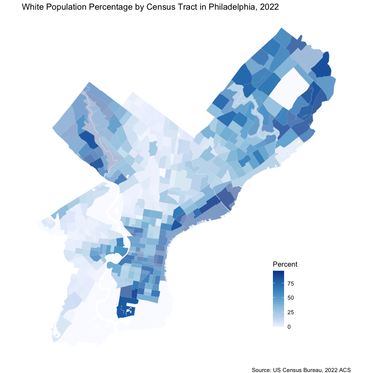

# Introduction

This template is for pulling data from the American Community Survey API of the US Census Bureau via the `tidycensus` package. The data is then processed and visualized using the `tidyverse`, `pander`, and `ggplot2` packages. We also use `tigris` to remove water features from the census tract geometries.


## API Call
This chunk is for pulling data from the ACS API. You will need to replace the `key` argument with your own API key. You can get an API key by registering at the [Census Bureau's website](https://api.census.gov/data/key_signup.html).


## Map
In this chunk, we create a map of the data. You can customize the map by changing the arguments in the `geom_sf` function.


```r
ggplot() +
  geom_sf(data = phl, aes(fill = white_pct, alpha = population), color = "transparent") +
  scale_fill_distiller(name = "Percent", direction = 1, palette = "Blues") +
  scale_alpha(range = c(0.3, 1.5), guide = "none") +
  theme_void() +
  labs(title = "White Population Percentage by Census Tract in Philadelphia, 2022",
       caption = "Source: US Census Bureau, 2022 ACS") +
  theme(legend.position = c(0.8, 0.2))
```

<!-- -->

## Table


```r
phl %>%
  st_drop_geometry() %>%
  summarize(avg_medhhinc = mean(medhhinc, na.rm = TRUE),
         avg_white_pct = mean(white_pct, na.rm = TRUE),
         avg_population = mean(population, na.rm = TRUE)) %>%
  pander(caption = "Summary of Philadelphia Census Tracts, 2022")
```


-----------------------------------------------
 avg_medhhinc   avg_white_pct   avg_population 
-------------- --------------- ----------------
    81239           36.98            3905      
-----------------------------------------------

Table: Summary of Philadelphia Census Tracts, 2022
