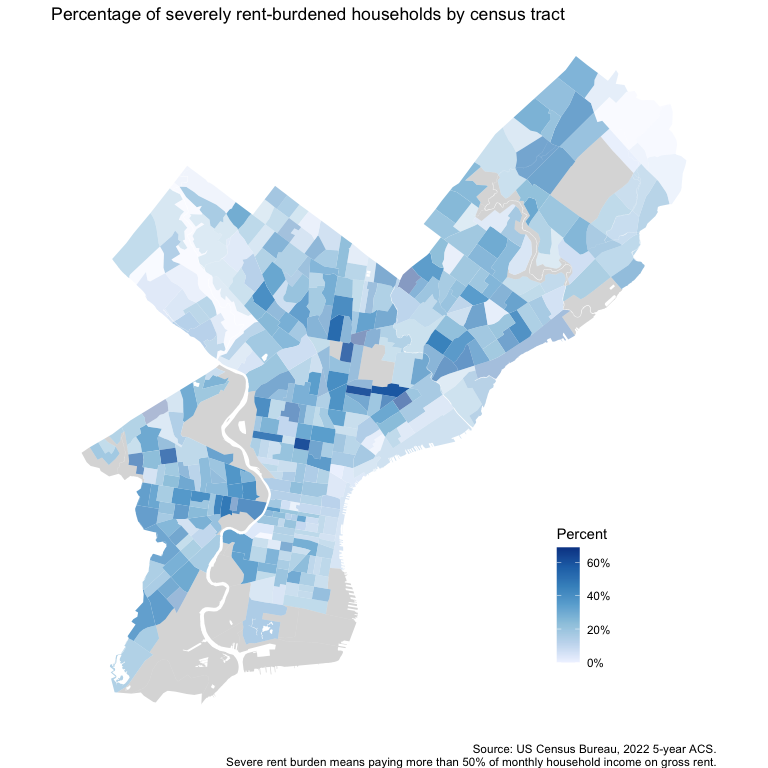
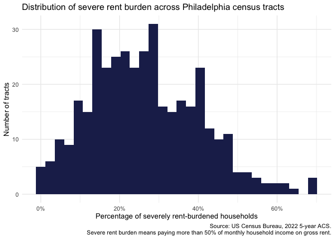

# Introduction

This template provides sample code and analysis considerations around obtaining and working with data from the American Community Survey. We use the US Census Bureau API via the `tidycensus` package. The data are then processed and visualized using the `tidyverse`, `sf`, and `ggplot2` packages. We also use `tigris` to remove water features from the census tract geometries.

⚠️ **Usage note**: *Nothing in this document is intended to be simply copied and pasted. You should read the accompanying text and linked resources to get an understanding of the context behind the code. The workflow demonstrated here will work for most uses, but it is for demonstration purposes only and every project will vary. As always, you're responsible for your own code.* ⚠️

We highly recommend perusing the Tidycensus book by Kyle Walker, available [here](https://walker-data.com/census-r/index.html). It is also a very helpful reference work for understanding how to use Census data in general.

For a through technical understanding, including how to calculate margins of error on derived estimates, see the Census Bureau's [Data User Guide for the ACS](https://www.census.gov/programs-surveys/acs/library/handbooks/general.html).

(The scope of this document is limited to the aggregated ACS tables published by the Census Bureau. For working with ACS microdata, see [the relevant chapter in the tidycensus book](https://walker-data.com/census-r/analyzing-census-microdata.html).)

# API key

If you have not already, obtain a Census API key by registering at the [Census Bureau's website](https://api.census.gov/data/key_signup.html), and save it to your local REnvironment file. It is not recommended that you expose your actual API key in working code, as API keys are private information and should not be revealed to third parties.

The easiest way to save your key is by running `usethis::edit_r_environ()`. It will open an editor window inside RStudio; add the line `CENSUS_API_KEY = '[YOUR API KEY]'`, replacing the relevant bit with your API key (make sure to preserve the quotes). The change will take effect after an R restart.

# Preliminary considerations

As with any project, before embarking on data analysis, you should ask:

- What is the purpose of this project?
- What are the questions we need to answer?
- What is the timeframe that is relevant to the project? (E.g., 2022-2024)
- What is the timescale that is relevant to the project? (E.g., yearly, monthly)
- What is the geographic scope of the project? (E.g., Pennsylvania, Los Angeles County, nationwide)
- What is the geographic scale of the project? (E.g., census tract, county, state)
- What is the acceptable margin of error?

How you answer these questions will be directly relevant to how you proceed, including in the usage of this document.

## Is ACS the right data source for my project?

Here are some useful heuristics to decide whether ACS is the right data source for you, and if so, which flavor of ACS is the most appropriate.

ACS may be a good data source for your project if:

- The question you are interested in can be informed by an ACS table (see below)
- You are interested in data collected between about 2010 and 1-2 calendar years ago
- You do not need data at timescales finer than yearly
- You need data with nationwide scope
- You need data at relatively fine geographic levels
- You need margins of error to be relatively small and documented

ACS may *not* be a good data source for your project if:

- There are no ACS tables that are relevant to your question
  - This can happen often if you need a detailed breakdown, for example the number of vehicles owned by low-income renters. If so, ACS microdata ([PUMS](https://www.census.gov/programs-surveys/acs/microdata.html)) may be a relevant source for you. [CHAS](https://www.huduser.gov/portal/datasets/cp.html) may also be a relevant source, especially if you need data at small geographic scales albeit with a significant time delay.
- You need longer term historical data
  - For historical timeseries, [IPUMS/NHGIS](https://www.nhgis.org/) provides harmonized historical timeseries
- You need detailed population estimates or migration estimates
  - `tidycensus::get_estimates()` and `tidycensus::get_flows()`, respectively, may be more relevant to you
  
## ACS API parameters
  
If ACS is a relevant data source for your project, here are some questions you need to consider before calling the API:

### What timescale do I need?

ACS data are released yearly, either as 1-year or 5-year files. One-year estimates are more current, but are only available for units of population size larger than 65,000 and the margins of error are larger. 

Here is a summary from the Census Bureau on the [differences between the 1-year and 5-year estimates](https://www.census.gov/programs-surveys/acs/guidance/estimates.html).

One-year data for year X are usually [released](https://www.census.gov/programs-surveys/acs/news/data-releases/2022/release-schedule.html) in September of year X+1. Five-year data are usually released in January of year X+2.

### What timeframe do I need?

If you need data from the year 2020, you will need to use 5-year data, as regular 1-year estimates were not released for 2020 due to pandemic data-collection related issues.

If you are comparing multiple years, the timeframe of the data sources should be mutually exclusive: either all 1-year, or 5-year estimates that do *not* overlap.

For historical comparisons, you also need to make sure that the geographic units you are analyzing did not change names or boundaries, and that the variables names or coding values also did not change. See [this section](https://walker-data.com/census-r/wrangling-census-data-with-tidyverse-tools.html#comparing-acs-estimates-over-time) in the tidycensus book for more details.

### What geographies do I need?

A large range of geographic levels are available via `tidycensus::get_acs()`. The full list can be consulted [here](https://walker-data.com/census-r/an-introduction-to-tidycensus.html#geography-and-variables-in-tidycensus). But note that not every geography will be available for every variable.

### Do I need spatial information appended?

If the data will feed into a GIS or mapping workflow, spatial geometries can be easily appended to the data by setting the `geometry` argument in `tidycensus::get_acs()` to `TRUE`. Otherwise, omit that argument from the call or set it to `FALSE` to preserve memory.

### What variables do I need?

This is the most complex of these questions, since the ACS includes thousands of variables. The [tidycensus book](https://walker-data.com/census-r/an-introduction-to-tidycensus.html#searching-for-variables-in-tidycensus) explains the usage of the `tidycensus::load_variables()` [function](https://walker-data.com/tidycensus/reference/load_variables.html), which can be called to fetch a full list of all ACS variables available for a particular year and dataset. 

For example, if you were interested in viewing the available variables for 2022 1-year ACS Detailed Tables, you would call:

```tidycensus::load_variables(year = 2022, dataset = "acs1", cache = TRUE)```

It is recommended to save this call to an object so it can be manipulated as a regular dataframe. Setting `cache = TRUE` is also recommended to save on memory space.

Another very helpful source is the [Census Reporter](https://censusreporter.org/topics/), which provides a searchable list of variables by topic. For example, this is the page on [housing topics](https://censusreporter.org/topics/housing/). This is a much more human-readable format, but you should look up the variable name using tidycensus directly as well to make sure you have the variable name string literally correct. 

#### Important note!

Never assume what variables and their response categories mean based on their names alone. Always check the ACS [subject definitions](https://www.census.gov/programs-surveys/acs/technical-documentation/code-lists.html) and the [questionnaire form](https://www.census.gov/programs-surveys/acs/about/forms-and-instructions.html) for your year(s) of analysis to make sure you understand how the Census Bureau operationalizes the variables and to make sure that the definitions, question wording, or response options do not change between years. 

# Worked example

Below, we walk step-by-step through the process of obtaining the ACS data, wrangling it, and mapping it.

For the purposes of this example, let's focus on the percentage of extremely rent-burdened renter households in Philadelphia, at the census tract level, as of the most recent data available.

## Data source consideration

First, is ACS the best source for answering this question? Alternatively, we could use PUMS or CHAS data, but the former would not allow us to look at detailed geographic levels, and the latter are much less timely.

## Variable selection

What are the variables we would need to answer this question? We see that in 2022 the Census Bureau added a [new table](https://www.census.gov/programs-surveys/acs/technical-documentation/table-and-geography-changes/2022/5-year.html) including "number of households paying more than 50% of their income toward housing costs". Viewing the table structure on [Census Reporter](https://censusreporter.org/tables/B25140/) and [Census Bureau's data portal](https://data.census.gov/table/ACSDT1Y2022.B25140?q=B25140&g=050XX00US42101) reveals that this provides the information we need. (But note that there are a number of other housing cost burden tables in the ACS, so don't just assume that this one is the one you need.)

Reading the [2022 ACS subject definitions](https://www2.census.gov/programs-surveys/acs/tech_docs/subject_definitions/2022_ACSSubjectDefinitions.pdf), we see that how the values are operationalized is also as we expect, noting that "Units for which no rent is paid
and units occupied by households that reported no income or a net loss comprise the category “Not computed.”".

We also note that the universe of this variable is "Occupied housing units". That is, the figures are at the household level, not at the individual level. This means that the denominator for calculating percentages should also be at the household level.

Therefore, we take as the denominator the values in Table B25003: Tenure. We [confirm](https://censusreporter.org/tables/B25003/) that the universe is the same, "Occupied housing units".


```r
variables <- tidycensus::load_variables(year = 2022, dataset = "acs1", cache = TRUE) %>% 
  filter(str_detect(name, "B25140") | str_detect(name, "B25003")) %>% 
  filter((concept == "Tenure" & 
            label == "Estimate!!Total:!!Renter occupied") |
           (concept == "Housing Costs as a Percentage of Household Income in the Past 12 Months" & 
              label == "Estimate!!Total:!!Rented!!Over 50 Percent"))
```

Note that we filter out to the two variables that we need, out of the many that are available for these tables. Note also that we chose as the denominator all renter households, not just those with nonzero income or rent. Therefore, our definition considers anyone with zero income or zero rent as not rent burdened. 

## Calling the API

We apply all of the preliminary questions we've already answered to construct the API call.


```
data_acs_raw <- 
  get_acs(survey = "acs5",
          year = 2022, 
          variables = variables$name,
          geography = "tract", 
          state = "PA",
          county = "Philadelphia",
          geometry = TRUE) 
```

Arguments used:

- `survey = "acs5"` Note that this argument defaults to the 5-year data; therefore, always specify explicitly, even (especially) if you are using 5-year data.
- `year = 2022` This is the most recent data available as of the time of writing
- `variables = variables$name` Since we filtered out to the variables we need already, we just call the existing vector. You can, of course, supply an ad-hoc vector, though you trade off the risk of copy-paste errors. There may also be reproducibility issues if someone copies your variable names while using a different year, if the variable name changed between years.
- `geography = "tract"` What it says on the tin
- `state = "PA"` and `county = "Philadelphia"` These arguments are to limit the API call to within Philadelphia; otherwise we would get nationwide data which would take longer and require another step to filter out.
- `geometry = TRUE` This appends a spatial geometry column to the data and turns the output into an `sf` object

Other arguments you could use:

- `output = "wide"` The default is to return a 'tidy' long dataframe, but you can specify it to return in wide format in the first place. This could be useful if you need just one row per geography regardless of how many variables you have. In fact, our example is one of these cases but here we just use the default value because that is probably more sensible for the majority of use cases.
- `moe_level = 95` If you need margins of error to be at the 0.95 confidence level instead of the default 0.90.

For more on the arguments, see the `tidycensus::get_acs()` documentation [here](https://walker-data.com/tidycensus/reference/get_acs.html).


```r
head(data_acs_raw)
```

```
## Simple feature collection with 6 features and 5 fields
## Geometry type: MULTIPOLYGON
## Dimension:     XY
## Bounding box:  xmin: -75.16735 ymin: 39.92551 xmax: -75.15233 ymax: 39.94366
## Geodetic CRS:  NAD83
##         GEOID                                                  NAME   variable
## 1 42101001500    Census Tract 15; Philadelphia County; Pennsylvania B25003_003
## 2 42101001500    Census Tract 15; Philadelphia County; Pennsylvania B25140_012
## 3 42101001800    Census Tract 18; Philadelphia County; Pennsylvania B25003_003
## 4 42101001800    Census Tract 18; Philadelphia County; Pennsylvania B25140_012
## 5 42101002802 Census Tract 28.02; Philadelphia County; Pennsylvania B25003_003
## 6 42101002802 Census Tract 28.02; Philadelphia County; Pennsylvania B25140_012
##   estimate moe                       geometry
## 1      614 170 MULTIPOLYGON (((-75.16558 3...
## 2      126  61 MULTIPOLYGON (((-75.16558 3...
## 3      778 249 MULTIPOLYGON (((-75.1662 39...
## 4       92  55 MULTIPOLYGON (((-75.1662 39...
## 5      927 308 MULTIPOLYGON (((-75.16735 3...
## 6      270 170 MULTIPOLYGON (((-75.16735 3...
```

## Data wrangling

Now we wrangle the data to be ready for analysis and plotting.


```r
data_acs_clean <- data_acs_raw %>% 
  # Select relevant columns and recast
  select(GEOID, variable, estimate, geometry) %>% 
  pivot_wider(names_from = "variable", values_from = "estimate") %>% 
  # Rename variables for easier reference
  rename(renter_households = B25003_003, 
         severely_burdened_renter_households = B25140_012) %>% 
  # Calculate the percentage
  mutate(severely_burdened_renter_percentage =
           severely_burdened_renter_households / renter_households) %>% 
  # Adjustment to the shape geometry for better mapping
  erase_water()

head(data_acs_clean)
```

```
## Simple feature collection with 6 features and 4 fields
## Geometry type: POLYGON
## Dimension:     XY
## Bounding box:  xmin: -75.24686 ymin: 39.91545 xmax: -75.15233 ymax: 39.94983
## Geodetic CRS:  NAD83
## # A tibble: 6 × 5
##   GEOID       renter_households severely_burdened_rente…¹ severely_burdened_re…²
##   <chr>                   <dbl>                     <dbl>                  <dbl>
## 1 42101001500               614                       126                  0.205
## 2 42101001800               778                        92                  0.118
## 3 42101002802               927                       270                  0.291
## 4 42101004001               977                       351                  0.359
## 5 42101006300              1122                       198                  0.176
## 6 42101007700               641                       215                  0.335
## # ℹ abbreviated names: ¹​severely_burdened_renter_households,
## #   ²​severely_burdened_renter_percentage
## # ℹ 1 more variable: geometry <POLYGON [°]>
```

## Mapping

Now we can create a map of the data. You can customize the map by changing the arguments in the `geom_sf` function.

Note that the year and the survey (1- or 5-year ACS) are noted in the source statement, which should always be done.


```r
ggplot() +
  geom_sf(data = data_acs_clean, 
          aes(fill = severely_burdened_renter_percentage, alpha = renter_households), 
          color = "transparent") +
  scale_fill_distiller(direction = 1, palette = "Blues", labels = label_percent(accuracy = 1)) +
  scale_alpha(range = c(0.3, 1.5), guide = "none") +
  theme_void() +
  labs(title = "Percentage of severely rent-burdened households by census tract",
       caption = "Source: US Census Bureau, 2022 5-year ACS.\nSevere rent burden means paying more than 50% of monthly household income on gross rent.",
       fill = "Percent") +
  theme(legend.position = c(0.8, 0.2))
```

<!-- -->

## Summary statistics

There are a number of ways you could present a summary of your data; here are just two possibilities.

### Histogram


```r
data_acs_clean %>% 
  ggplot(aes(x = severely_burdened_renter_percentage)) +
  geom_histogram(fill = "#1f2859ff") +
  scale_x_continuous(labels = label_percent(accuracy = 1)) +
  theme_minimal() +
  labs(title = "Distribution of severe rent burden across Philadelphia census tracts",
       caption = "Source: US Census Bureau, 2022 5-year ACS.\nSevere rent burden means paying more than 50% of monthly household income on gross rent.",
       x = "Percentage of severely rent-burdened households",
       y = "Number of tracts")
```

<!-- -->

### Table


```r
data_acs_table <- data_acs_clean %>%
  st_drop_geometry() %>%
  mutate(severe_rent_burden_category =
           case_when(severely_burdened_renter_percentage < 0.25 ~ 
                       "Less than 25% severely rent burdened",
                     severely_burdened_renter_percentage < 0.5 ~ 
                       "25%-50% severely rent burdened",
                     severely_burdened_renter_percentage < 0.75 ~ 
                       "50%-75% severely rent burdened",
                     severely_burdened_renter_percentage <= 1 ~ 
                       "More than 75% severely rent burdened",
                     .default = NA)) %>% 
  # Note that some tracts have no renter households, which are dropped
  filter(renter_households != 0) %>% 
  summarize(.by = severe_rent_burden_category,
            number_of_tracts = n()) %>% 
  mutate(percentage_of_tracts = number_of_tracts / sum(number_of_tracts)) %>% 
    mutate(severe_rent_burden_category =
           fct_relevel(severe_rent_burden_category,
                       "More than 75% severely rent burdened",
                       "50%-75% severely rent burdened",
                       "25%-50% severely rent burdened",
                       "Less than 25% severely rent burdened")) %>% 
  arrange(severe_rent_burden_category)

data_acs_table %>% 
  gt() %>% 
  cols_label_with(fn = ~ snakecase::to_sentence_case(.)) %>% 
  fmt_percent(columns = contains("percent"), decimals = 0) %>% 
  fmt_number(columns = contains("number"), decimals = 0) %>% 
  tab_style(style = cell_text(weight = "bold"), 
            locations = cells_column_labels()) %>% 
  tab_header(title = "Severe rent burden among Philadelphia census tracts") %>% 
  tab_source_note(html("Source: US Census Bureau, 2022 5-year ACS.
                       <br>
                       Severe rent burden means paying more than 50% of monthly household income on gross rent."))
```

```{=html}
<div id="xiehgitdbj" style="padding-left:0px;padding-right:0px;padding-top:10px;padding-bottom:10px;overflow-x:auto;overflow-y:auto;width:auto;height:auto;">
<style>#xiehgitdbj table {
  font-family: system-ui, 'Segoe UI', Roboto, Helvetica, Arial, sans-serif, 'Apple Color Emoji', 'Segoe UI Emoji', 'Segoe UI Symbol', 'Noto Color Emoji';
  -webkit-font-smoothing: antialiased;
  -moz-osx-font-smoothing: grayscale;
}

#xiehgitdbj thead, #xiehgitdbj tbody, #xiehgitdbj tfoot, #xiehgitdbj tr, #xiehgitdbj td, #xiehgitdbj th {
  border-style: none;
}

#xiehgitdbj p {
  margin: 0;
  padding: 0;
}

#xiehgitdbj .gt_table {
  display: table;
  border-collapse: collapse;
  line-height: normal;
  margin-left: auto;
  margin-right: auto;
  color: #333333;
  font-size: 16px;
  font-weight: normal;
  font-style: normal;
  background-color: #FFFFFF;
  width: auto;
  border-top-style: solid;
  border-top-width: 2px;
  border-top-color: #A8A8A8;
  border-right-style: none;
  border-right-width: 2px;
  border-right-color: #D3D3D3;
  border-bottom-style: solid;
  border-bottom-width: 2px;
  border-bottom-color: #A8A8A8;
  border-left-style: none;
  border-left-width: 2px;
  border-left-color: #D3D3D3;
}

#xiehgitdbj .gt_caption {
  padding-top: 4px;
  padding-bottom: 4px;
}

#xiehgitdbj .gt_title {
  color: #333333;
  font-size: 125%;
  font-weight: initial;
  padding-top: 4px;
  padding-bottom: 4px;
  padding-left: 5px;
  padding-right: 5px;
  border-bottom-color: #FFFFFF;
  border-bottom-width: 0;
}

#xiehgitdbj .gt_subtitle {
  color: #333333;
  font-size: 85%;
  font-weight: initial;
  padding-top: 3px;
  padding-bottom: 5px;
  padding-left: 5px;
  padding-right: 5px;
  border-top-color: #FFFFFF;
  border-top-width: 0;
}

#xiehgitdbj .gt_heading {
  background-color: #FFFFFF;
  text-align: center;
  border-bottom-color: #FFFFFF;
  border-left-style: none;
  border-left-width: 1px;
  border-left-color: #D3D3D3;
  border-right-style: none;
  border-right-width: 1px;
  border-right-color: #D3D3D3;
}

#xiehgitdbj .gt_bottom_border {
  border-bottom-style: solid;
  border-bottom-width: 2px;
  border-bottom-color: #D3D3D3;
}

#xiehgitdbj .gt_col_headings {
  border-top-style: solid;
  border-top-width: 2px;
  border-top-color: #D3D3D3;
  border-bottom-style: solid;
  border-bottom-width: 2px;
  border-bottom-color: #D3D3D3;
  border-left-style: none;
  border-left-width: 1px;
  border-left-color: #D3D3D3;
  border-right-style: none;
  border-right-width: 1px;
  border-right-color: #D3D3D3;
}

#xiehgitdbj .gt_col_heading {
  color: #333333;
  background-color: #FFFFFF;
  font-size: 100%;
  font-weight: normal;
  text-transform: inherit;
  border-left-style: none;
  border-left-width: 1px;
  border-left-color: #D3D3D3;
  border-right-style: none;
  border-right-width: 1px;
  border-right-color: #D3D3D3;
  vertical-align: bottom;
  padding-top: 5px;
  padding-bottom: 6px;
  padding-left: 5px;
  padding-right: 5px;
  overflow-x: hidden;
}

#xiehgitdbj .gt_column_spanner_outer {
  color: #333333;
  background-color: #FFFFFF;
  font-size: 100%;
  font-weight: normal;
  text-transform: inherit;
  padding-top: 0;
  padding-bottom: 0;
  padding-left: 4px;
  padding-right: 4px;
}

#xiehgitdbj .gt_column_spanner_outer:first-child {
  padding-left: 0;
}

#xiehgitdbj .gt_column_spanner_outer:last-child {
  padding-right: 0;
}

#xiehgitdbj .gt_column_spanner {
  border-bottom-style: solid;
  border-bottom-width: 2px;
  border-bottom-color: #D3D3D3;
  vertical-align: bottom;
  padding-top: 5px;
  padding-bottom: 5px;
  overflow-x: hidden;
  display: inline-block;
  width: 100%;
}

#xiehgitdbj .gt_spanner_row {
  border-bottom-style: hidden;
}

#xiehgitdbj .gt_group_heading {
  padding-top: 8px;
  padding-bottom: 8px;
  padding-left: 5px;
  padding-right: 5px;
  color: #333333;
  background-color: #FFFFFF;
  font-size: 100%;
  font-weight: initial;
  text-transform: inherit;
  border-top-style: solid;
  border-top-width: 2px;
  border-top-color: #D3D3D3;
  border-bottom-style: solid;
  border-bottom-width: 2px;
  border-bottom-color: #D3D3D3;
  border-left-style: none;
  border-left-width: 1px;
  border-left-color: #D3D3D3;
  border-right-style: none;
  border-right-width: 1px;
  border-right-color: #D3D3D3;
  vertical-align: middle;
  text-align: left;
}

#xiehgitdbj .gt_empty_group_heading {
  padding: 0.5px;
  color: #333333;
  background-color: #FFFFFF;
  font-size: 100%;
  font-weight: initial;
  border-top-style: solid;
  border-top-width: 2px;
  border-top-color: #D3D3D3;
  border-bottom-style: solid;
  border-bottom-width: 2px;
  border-bottom-color: #D3D3D3;
  vertical-align: middle;
}

#xiehgitdbj .gt_from_md > :first-child {
  margin-top: 0;
}

#xiehgitdbj .gt_from_md > :last-child {
  margin-bottom: 0;
}

#xiehgitdbj .gt_row {
  padding-top: 8px;
  padding-bottom: 8px;
  padding-left: 5px;
  padding-right: 5px;
  margin: 10px;
  border-top-style: solid;
  border-top-width: 1px;
  border-top-color: #D3D3D3;
  border-left-style: none;
  border-left-width: 1px;
  border-left-color: #D3D3D3;
  border-right-style: none;
  border-right-width: 1px;
  border-right-color: #D3D3D3;
  vertical-align: middle;
  overflow-x: hidden;
}

#xiehgitdbj .gt_stub {
  color: #333333;
  background-color: #FFFFFF;
  font-size: 100%;
  font-weight: initial;
  text-transform: inherit;
  border-right-style: solid;
  border-right-width: 2px;
  border-right-color: #D3D3D3;
  padding-left: 5px;
  padding-right: 5px;
}

#xiehgitdbj .gt_stub_row_group {
  color: #333333;
  background-color: #FFFFFF;
  font-size: 100%;
  font-weight: initial;
  text-transform: inherit;
  border-right-style: solid;
  border-right-width: 2px;
  border-right-color: #D3D3D3;
  padding-left: 5px;
  padding-right: 5px;
  vertical-align: top;
}

#xiehgitdbj .gt_row_group_first td {
  border-top-width: 2px;
}

#xiehgitdbj .gt_row_group_first th {
  border-top-width: 2px;
}

#xiehgitdbj .gt_summary_row {
  color: #333333;
  background-color: #FFFFFF;
  text-transform: inherit;
  padding-top: 8px;
  padding-bottom: 8px;
  padding-left: 5px;
  padding-right: 5px;
}

#xiehgitdbj .gt_first_summary_row {
  border-top-style: solid;
  border-top-color: #D3D3D3;
}

#xiehgitdbj .gt_first_summary_row.thick {
  border-top-width: 2px;
}

#xiehgitdbj .gt_last_summary_row {
  padding-top: 8px;
  padding-bottom: 8px;
  padding-left: 5px;
  padding-right: 5px;
  border-bottom-style: solid;
  border-bottom-width: 2px;
  border-bottom-color: #D3D3D3;
}

#xiehgitdbj .gt_grand_summary_row {
  color: #333333;
  background-color: #FFFFFF;
  text-transform: inherit;
  padding-top: 8px;
  padding-bottom: 8px;
  padding-left: 5px;
  padding-right: 5px;
}

#xiehgitdbj .gt_first_grand_summary_row {
  padding-top: 8px;
  padding-bottom: 8px;
  padding-left: 5px;
  padding-right: 5px;
  border-top-style: double;
  border-top-width: 6px;
  border-top-color: #D3D3D3;
}

#xiehgitdbj .gt_last_grand_summary_row_top {
  padding-top: 8px;
  padding-bottom: 8px;
  padding-left: 5px;
  padding-right: 5px;
  border-bottom-style: double;
  border-bottom-width: 6px;
  border-bottom-color: #D3D3D3;
}

#xiehgitdbj .gt_striped {
  background-color: rgba(128, 128, 128, 0.05);
}

#xiehgitdbj .gt_table_body {
  border-top-style: solid;
  border-top-width: 2px;
  border-top-color: #D3D3D3;
  border-bottom-style: solid;
  border-bottom-width: 2px;
  border-bottom-color: #D3D3D3;
}

#xiehgitdbj .gt_footnotes {
  color: #333333;
  background-color: #FFFFFF;
  border-bottom-style: none;
  border-bottom-width: 2px;
  border-bottom-color: #D3D3D3;
  border-left-style: none;
  border-left-width: 2px;
  border-left-color: #D3D3D3;
  border-right-style: none;
  border-right-width: 2px;
  border-right-color: #D3D3D3;
}

#xiehgitdbj .gt_footnote {
  margin: 0px;
  font-size: 90%;
  padding-top: 4px;
  padding-bottom: 4px;
  padding-left: 5px;
  padding-right: 5px;
}

#xiehgitdbj .gt_sourcenotes {
  color: #333333;
  background-color: #FFFFFF;
  border-bottom-style: none;
  border-bottom-width: 2px;
  border-bottom-color: #D3D3D3;
  border-left-style: none;
  border-left-width: 2px;
  border-left-color: #D3D3D3;
  border-right-style: none;
  border-right-width: 2px;
  border-right-color: #D3D3D3;
}

#xiehgitdbj .gt_sourcenote {
  font-size: 90%;
  padding-top: 4px;
  padding-bottom: 4px;
  padding-left: 5px;
  padding-right: 5px;
}

#xiehgitdbj .gt_left {
  text-align: left;
}

#xiehgitdbj .gt_center {
  text-align: center;
}

#xiehgitdbj .gt_right {
  text-align: right;
  font-variant-numeric: tabular-nums;
}

#xiehgitdbj .gt_font_normal {
  font-weight: normal;
}

#xiehgitdbj .gt_font_bold {
  font-weight: bold;
}

#xiehgitdbj .gt_font_italic {
  font-style: italic;
}

#xiehgitdbj .gt_super {
  font-size: 65%;
}

#xiehgitdbj .gt_footnote_marks {
  font-size: 75%;
  vertical-align: 0.4em;
  position: initial;
}

#xiehgitdbj .gt_asterisk {
  font-size: 100%;
  vertical-align: 0;
}

#xiehgitdbj .gt_indent_1 {
  text-indent: 5px;
}

#xiehgitdbj .gt_indent_2 {
  text-indent: 10px;
}

#xiehgitdbj .gt_indent_3 {
  text-indent: 15px;
}

#xiehgitdbj .gt_indent_4 {
  text-indent: 20px;
}

#xiehgitdbj .gt_indent_5 {
  text-indent: 25px;
}
</style>
<table class="gt_table" data-quarto-disable-processing="false" data-quarto-bootstrap="false">
  <thead>
    <tr class="gt_heading">
      <td colspan="3" class="gt_heading gt_title gt_font_normal gt_bottom_border" style>Severe rent burden among Philadelphia census tracts</td>
    </tr>
    
    <tr class="gt_col_headings">
      <th class="gt_col_heading gt_columns_bottom_border gt_center" rowspan="1" colspan="1" style="font-weight: bold;" scope="col" id="Severe rent burden category">Severe rent burden category</th>
      <th class="gt_col_heading gt_columns_bottom_border gt_right" rowspan="1" colspan="1" style="font-weight: bold;" scope="col" id="Number of tracts">Number of tracts</th>
      <th class="gt_col_heading gt_columns_bottom_border gt_right" rowspan="1" colspan="1" style="font-weight: bold;" scope="col" id="Percentage of tracts">Percentage of tracts</th>
    </tr>
  </thead>
  <tbody class="gt_table_body">
    <tr><td headers="severe_rent_burden_category" class="gt_row gt_center">50%-75% severely rent burdened</td>
<td headers="number_of_tracts" class="gt_row gt_right">19</td>
<td headers="percentage_of_tracts" class="gt_row gt_right">5%</td></tr>
    <tr><td headers="severe_rent_burden_category" class="gt_row gt_center">25%-50% severely rent burdened</td>
<td headers="number_of_tracts" class="gt_row gt_right">179</td>
<td headers="percentage_of_tracts" class="gt_row gt_right">46%</td></tr>
    <tr><td headers="severe_rent_burden_category" class="gt_row gt_center">Less than 25% severely rent burdened</td>
<td headers="number_of_tracts" class="gt_row gt_right">189</td>
<td headers="percentage_of_tracts" class="gt_row gt_right">49%</td></tr>
  </tbody>
  <tfoot class="gt_sourcenotes">
    <tr>
      <td class="gt_sourcenote" colspan="3">Source: US Census Bureau, 2022 5-year ACS.
                       <br>
                       Severe rent burden means paying more than 50% of monthly household income on gross rent.</td>
    </tr>
  </tfoot>
  
</table>
</div>
```

# Multi-year comparisons

If your analysis requires comparisons across multiple years, make sure you check for any differences between years regarding:

- Geography names (including GEOIDs)
- Geography boundaries
- Subject definitions
- Variable names

Also make sure that you do not overlap years (e.g., don't mix the 2022 5-year with the 2021 5-year).

When you call the API, do not create a separate dataframe for each year of analysis. As the number of years increases, it makes the code increasingly unreadable and creates a significant risk of copy-paste errors. Write a function instead! Once you create a function for callig a single year, use `purrr::map()` to iterate over a vector of years to get a single dataframe with all the years you need.


